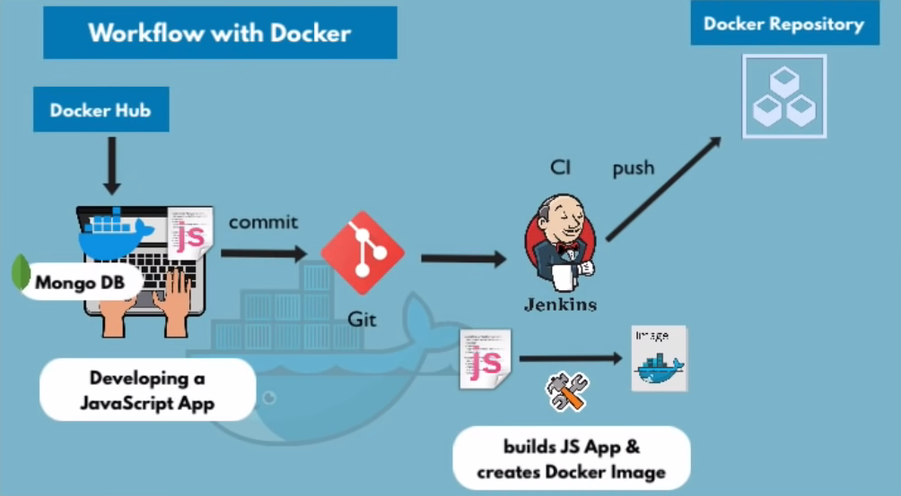
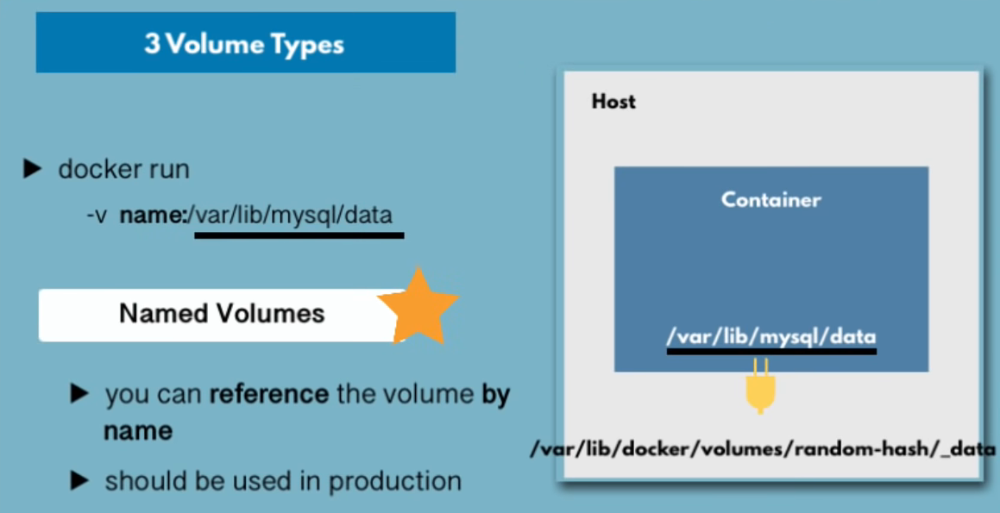

# Nội dung
- Docker là gì và nó giải quyết những vấn đề gì?

- So sánh Docker với máy ảo (Virtual Machine).

- Cài đặt Docker và tìm hiểu các lệnh cơ bản để khởi động, dừng và debug container,...

- Sử dụng Docker trong thực tế thông qua một dự án demo:

    - Phát triển ứng dụng với container.

    - Chạy nhiều container cùng lúc bằng Docker Compose.

    - Tạo Docker image bằng Dockerfile.

    - Đẩy image lên kho Docker riêng trên AWS.

    - Triển khai ứng dụng container hóa.

- Tìm hiểu về cách lưu trữ dữ liệu trong Docker, các loại volume khác nhau và cách thiết lập lưu trữ dữ liệu cho dự án demo.

    
    

